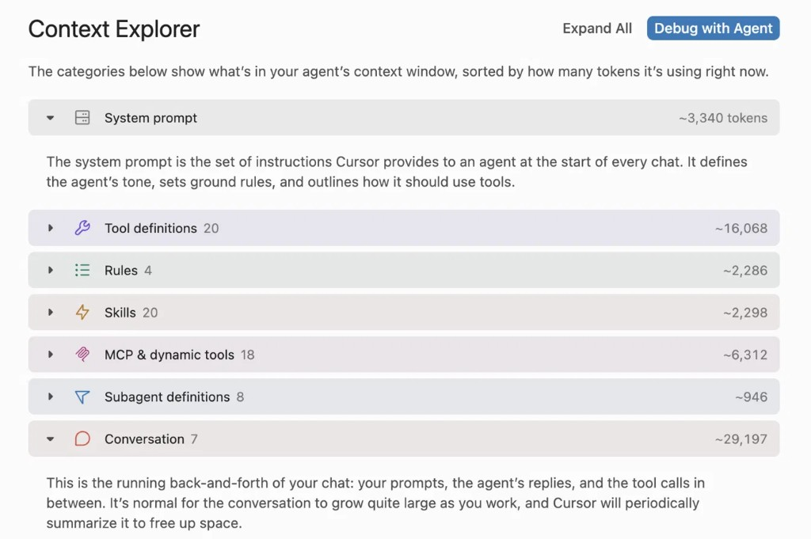
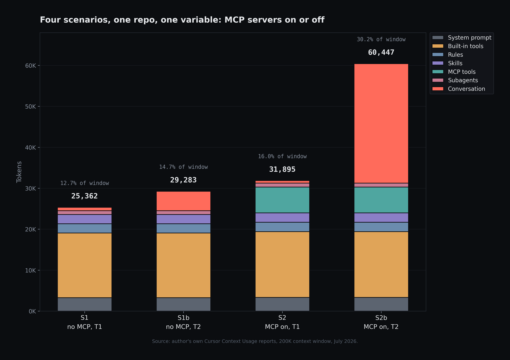
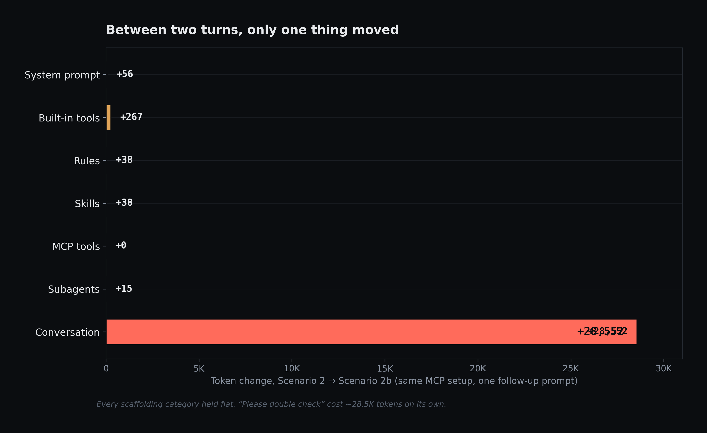
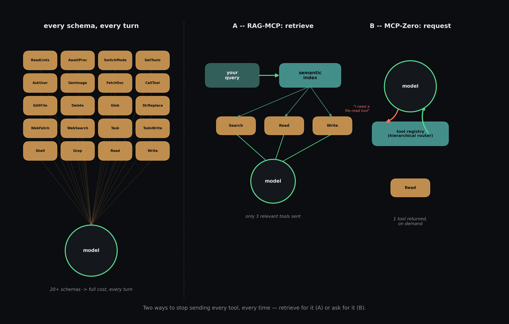
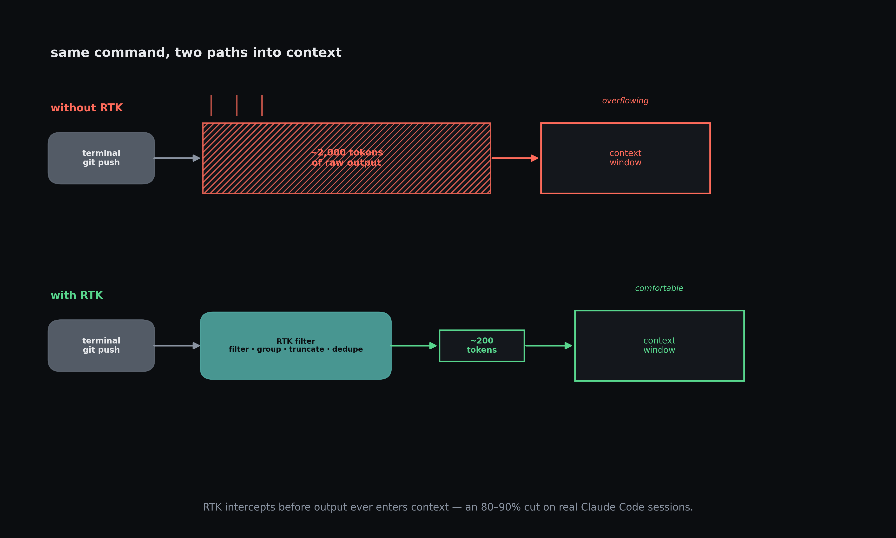
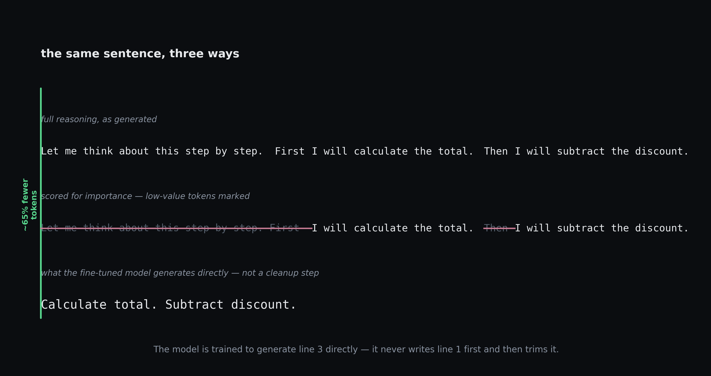
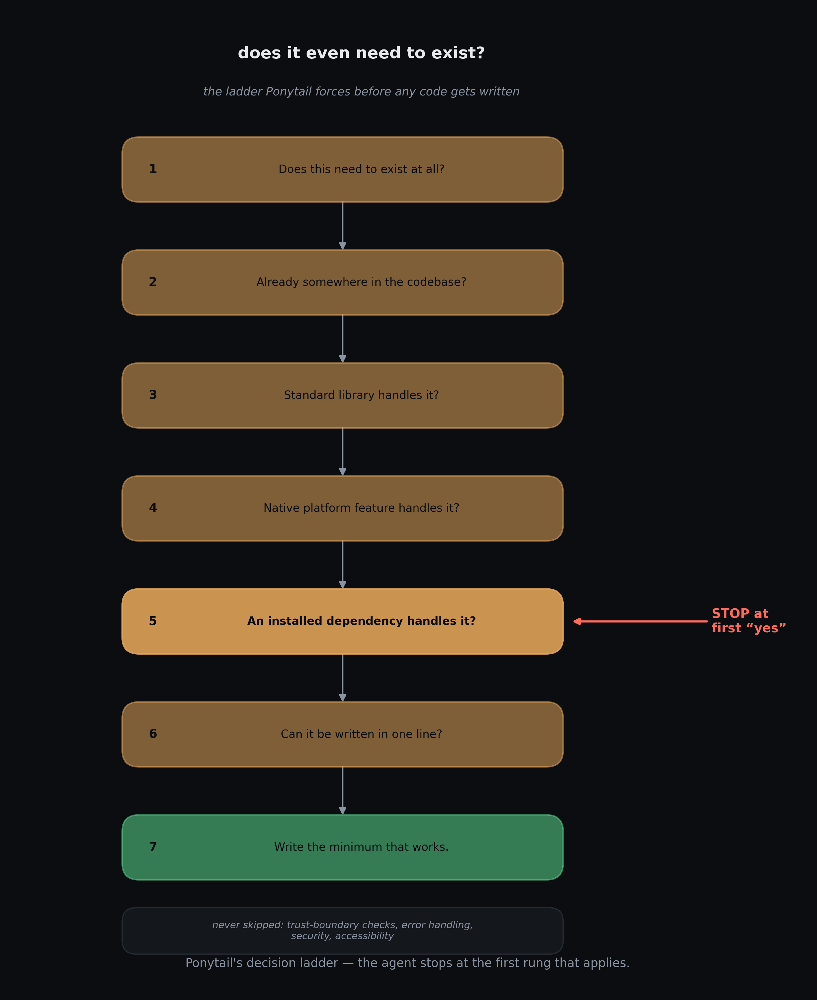

<!--
TITLE: The Anatomy of a Token Bill: What AI Coding Agents Spend Before You Even Ask
SUBTITLE: A field guide to context bloat in Claude Code, Cursor, and
friends — and everything people have built to fight it.

FILE DEPENDENCY: this draft references images via relative path
figures/*.png. Keep this file and the figures/ folder in the same
directory. If downloaded separately (e.g. via individual file links),
recreate that structure locally before previewing, or re-point the paths.
When pasting into Medium, upload each PNG directly and delete these
markdown image lines as you go — Medium does not resolve relative paths.
-->

## Abstract

Every message you send an AI coding agent silently re-sends a mountain of context: the tool definitions, rules, and scaffolding the agent uses to describe itself, plus the entire growing conversation, re-read in full on every turn. A small measured experiment in Cursor makes the shape of the problem concrete: the user prompt is the smallest line on the bill, while invisible scaffolding and accumulating tool output dominate; MCP servers add a real tax, but a smaller one than their reputation suggests. From there, the piece becomes a field guide to what people have actually built to fight context bloat, organized by which slice of the bill each attacks: retrieving or requesting tool schemas on demand instead of dumping them all, filtering or compressing conversation output before and after it lands, trimming the model’s own reasoning, and teaching the agent to write less in the first place. The throughline is simple: context is a budget you keep re-paying, most of it invisible, and the cheapest wins come from first learning to read your own bill.

# The Anatomy of a Token Bill

I opened a fresh Cursor session, turned off every MCP server I had connected, and asked it one question: "how many MCP servers do I have connected?" Then I did the thing everyone does when a computer tells you something — I didn't quite believe it, so I asked again. "Please double check."

Two questions. Maybe fifteen words of typing on my end. I pulled up the context usage report afterward mostly out of curiosity, and I did not expect the number I got. Then I ran it again with every MCP server switched back on, asked the same two questions, and watched the total climb to 60.4K tokens — 30% of a 200K window — for a conversation you could read out loud in under ten seconds.

I've been using Claude Code and Cursor daily for months, and like most people I add MCP servers the way you add browser extensions: something looks useful, you connect it, you move on. I'd never actually sat down and measured what that habit costs per turn. So I did. Four scenarios, same repo, same two questions, MCP servers on and off. Here's exactly where it all went.

## The four-scenario experiment

The setup was boring on purpose: same repo, same 200K context window, same two prompts every time — a throwaway question, then a follow-up asking the agent to double-check itself. The only thing I changed was whether my MCP servers were on or off. Boring is what you want when you're trying to isolate one variable.

**Scenario 1 — no MCP servers, one question.** Total: ~25.4K tokens. Here's the part that surprised me: ~24.6K of that — roughly 97% — was scaffolding I never see. System prompt, Cursor's own built-in tool definitions, rules, skills, subagent definitions. My actual question was worth about 838 tokens. Everything else was Cursor talking to itself before I said a word.

And that scaffolding isn't small. Cursor's built-in tools alone — Shell, Task, TodoWrite, Grep, WebFetch, and a dozen others — cost about 15.8K tokens every single turn, with zero MCP servers connected. I want to sit with that for a second, because it reframes the whole conversation people have about MCP bloat: MCP servers don't introduce the tool-definition tax. They pile onto one you were already paying, quietly, on every message, for tools you use maybe once a session.

**Scenario 1b — same setup, then "are you double sure, please check again."** Total climbed to ~29.3K, and here's the useful part: every scaffolding line stayed exactly the same token-for-token — system prompt, tool definitions, rules, skills, subagents, all frozen. The only thing that moved was the conversation itself, from 838 tokens to 4,759. My seven-word follow-up, plus the agent's re-verification and its reply, cost roughly four thousand tokens. A polite double-check is not free, and it's not close to free.

**Scenario 2 — fresh session, all MCP servers on, same first question.** Total: ~31.9K. My 18 MCP tools added about 6.3K tokens of schemas — call it 350 tokens per tool, paid every turn whether I use it or not. What I didn't expect: turning MCPs on nudged almost everything else up too. System prompt +56 tokens. Built-in tool definitions +267. Rules +38. Skills +38. Subagents +15. Small numbers individually, but it told me the scaffolding isn't as modular as I assumed — wiring in MCP support seems to touch glue text across categories that have nothing to do with MCP on paper.

**Scenario 2b — same MCP setup, same follow-up question.** This is the one that actually made me sit up. Total: ~60.4K. The scaffolding, again, didn't move — frozen at the same ~31.3K as Scenario 2. Conversation alone went from 645 tokens to 29,197. But the fairest comparison isn't the conversation total, it's the follow-up turn itself in isolation: "please check again" cost about 3,292 tokens with no MCPs connected (Scenario 1b's Turn 2), and about 24,708 tokens with MCPs connected (Scenario 2b's Turn 2) — roughly 7x more for the identical three words, because this time the agent didn't just reply, it actually went and re-queried its tools, and the results came flooding back into the conversation.

*This is the actual report, not a mockup — Conversation (~29,197) dwarfing everything else in the list is the whole post in one screenshot.*

*Source: author's own Cursor Context Usage reports, 200K context window, July 2026.*

*Every scaffolding category held flat. "Please double check" cost ~28.5K tokens on its own.*

So here's the shape of it, in plain terms: most of what fills your context window on turn one isn't your prompt, it's Cursor (or Claude Code, or whatever you're running) re-explaining itself to the model. MCP servers add a real but — in my case — comparatively modest tax to that baseline. And then the conversation itself, especially once tool calls start producing real output, becomes the thing that actually eats the window. Tool results and model replies don't evaporate after they're generated. They sit in the conversation, and the conversation gets re-read, in full, every single turn. Two turns took me to 30% of a 200K window. I don't want to know what a full afternoon of real debugging looks like — actually, I do, and I'm a little afraid to check.

One honest caveat before I get to the fixes: my MCP tax (6.3K for 18 tools) is much gentler than the horror stories floating around online, where people report 40-tool stacks eating 143K of a 200K window on schemas alone. Two likely reasons. My servers expose fairly lean tool descriptions, and Cursor seems to manage MCP definitions somewhat dynamically rather than dumping every tool's full schema into every prompt — I noticed built-ins like `GetMcpTools` and `CallMcpTool` in the report, which suggests some tools are fetched on demand rather than injected wholesale (that's my inference from what the report shows, not a confirmed detail of how Cursor works internally). The honest version of my finding isn't "MCP bloat is a myth" — it's "my setup is close to the good case, and it still costs 6.3K tokens a turn before I've done anything." Your mileage, depending on which servers you've bolted on, could be a lot worse.

I also built a small interactive simulator for how this compounds over more than two turns — worth poking at: [token-budget-explainer](https://soumitra9.github.io/token-budget-explainer/)

## What people have actually built to fight this

Every fix below goes after one specific slice of what I just measured. I'll take them in the order they showed up above: the tool definitions first, then the conversation/output side, then the model's own reasoning, and last, a category that isn't about compressing anything at all.

### Tool definitions

**RAG-MCP.** What it does: instead of handing the model every connected tool's full schema, it embeds all your tool descriptions into a semantic index ahead of time, and at query time retrieves only the handful that actually look relevant to what you asked. Why it matters: the paper reports cutting prompt tokens by more than half, and more than tripling tool-selection accuracy (43.13% vs. 13.62%) as the tool pool grows — which tracks with something I half-suspected but hadn't seen measured: more tools doesn't just cost tokens, it seems to actually confuse the model about which one to use. Paper: arxiv.org/abs/2505.03275.

RAG-MCP retrieves candidates for the model. **MCP-Zero** flips that: the model itself requests the tools it thinks it needs, resolved through a hierarchical router, rather than being handed a pre-filtered shortlist. On a dataset of 308 MCP servers and roughly 2,800 tools, it reports a 98% reduction in token consumption on APIBank while holding accuracy steady. Paper: arxiv.org/abs/2506.01056.

Honestly, though? Before you reach for either of those, the boring fix works fine: go look at which MCP servers you actually use and turn the rest off. Based on what I measured, that's a smaller win in absolute tokens than my numbers above might suggest — but it's zero effort, and it's the one thing on this whole list you can do in the next thirty seconds.

### The conversation and its outputs

There's a useful split hiding in this category, once you notice it: some tools intercept content *before* it enters the context window, others compress what's already headed in.

**RTK (Rust Token Killer)** is the pre-filter approach, and it's the one I found most compelling given what Scenario 2b showed me. It's a CLI proxy — a single Rust binary — that sits in front of over 100 common dev commands. A hook rewrites your shell commands before they run (`git status` quietly becomes `rtk git status`), and the agent gets back filtered, compact output instead of the raw firehose. Their own estimate for a 30-minute Claude Code session: about 118K tokens of raw command output reduced to roughly 23.9K — an 80% cut, with test runners like pytest and cargo test seeing 90% reductions. It's not a toy project either; it's sitting at 64.9k GitHub stars, which is more adoption than most of the papers on this list will ever see. Repo: github.com/rtk-ai/rtk.

**Headroom** takes the opposite position in the pipeline: it compresses content that's already destined for context behind a hash, and lets the agent retrieve the original later if it actually needs the full thing. Think of it like checking a bulky coat at the door and getting a claim ticket instead of carrying it around all night. Repo: github.com/headroomlabs-ai/headroom.

**lean-ctx** sits in the same post-filter camp as Headroom but specializes in code: it's AST-aware, so instead of blindly truncating a file read it parses the structure, keeps signatures, and drops function bodies you probably don't need — up to 99% savings on repeat reads, depending on mode and how warm the cache is. Repo: github.com/yvgude/lean-ctx.

And then there's **compaction**, which most people using Claude Code have already seen happen without necessarily knowing its name — the tool periodically summarizes older parts of the conversation to free up room. It's the one fix on this list you don't have to install; it's already running quietly in the background of tools you probably already use.

### The model's own reasoning

This is the category with the most interesting recent history, because the story here isn't "here's a fix," it's "the first famous fix turned out not to be the best one."

**TokenSkip** got there first, in early 2025. The idea: score every token in a chain-of-thought for how much it actually matters to reaching the right answer, build training examples that keep only the important ones at various target ratios, then fine-tune the model so it generates the shortened version directly — not as a cleanup step afterward, but as its native output. In its safe zone, that works well: on Qwen2.5-14B, GSM8K reasoning dropped from 313 to 181 tokens with less than a 0.4% accuracy loss. Paper: arxiv.org/abs/2502.12067.

Here's the part I didn't expect going in: TokenSkip is not the strong baseline anymore, it's the one newer papers use to show how much better they are. Push it to aggressive compression ratios and it gets unstable — one direct comparison found accuracy drops of over 20 points, and a separate study on software-engineering reasoning tasks found it sometimes produces output *longer* than the uncompressed baseline, due to truncation artifacts. Newer methods — CtrlCoT and Extra-CoT among them — now beat it at every ratio the papers report, with Extra-CoT specifically staying stable at compression as extreme as keeping only 20% of the original tokens, where TokenSkip falls apart.

Worth remembering while you're weighing whether any of this is worth the effort: reasoning tokens don't just cost something once and disappear. Whatever the model thinks out loud this turn gets carried into next turn's history, and the turn after that. Shave it down now and every future turn inherits a little more room.

The one I'd actually try first, if I were you: **Chain of Draft**. No fine-tuning, no scorer, no training pairs — you just add an instruction to your prompt asking the model to keep each reasoning step to about five words. That's it. Reported cuts run as high as 90%+ on some task types with accuracy holding steady or even improving. I tried it on a debugging session expecting basically nothing, and it embarrassed every fine-tuning plan I'd been mentally sketching out — five minutes of prompt-editing did more than I expected a whole training pipeline to do. Paper: arxiv.org/abs/2502.18600.

### Agent behavior — the tokens you never spend

Everything above compresses tokens after the model has already decided to produce them. This last category is different: it changes what the model decides to write in the first place.

**Ponytail** is a rules file — a skill you drop into Claude Code, Cursor, or Codex — that forces the agent through a decision ladder before it writes any code at all: does this even need to exist? Is it already somewhere in the codebase? Does the standard library handle it? The native platform? An already-installed dependency? Can it be one line? Only after all of that comes up empty does it write anything, and even then, the minimum that works. It's explicitly not lazy about the things that matter — trust-boundary validation, error handling, security, accessibility are all carved out and left alone. Their own benchmark, run against a real FastAPI-plus-React repo with Claude Code on Haiku 4.5, reports roughly 54% less code, 22% fewer tokens, 20% lower cost, and 27% faster completion, with equal safety scores against the same adversarial checks. Repo: github.com/DietrichGebert/ponytail.

There's also a quieter entry in this category: a single CLAUDE.md file distilling a handful of Andrej Karpathy's public observations about where LLM coding goes wrong into four rules — think before coding, simplicity first, surgical changes, goal-driven execution — aimed at the specific failure mode where a model happily writes a thousand lines to do what a hundred would've done. Its own definition of success (fewer unnecessary diff changes, fewer full rewrites, smaller pull requests) is really just a token metric wearing a different name. It's sitting at roughly 184k GitHub stars, which I find genuinely funny to sit with for a second: the single most-adopted "token optimizer" in this entire list isn't a paper, isn't a Rust binary, isn't a fine-tune — it's a prompt file. Repo: github.com/multica-ai/andrej-karpathy-skills.

Worth saying plainly, because it would be a little dishonest not to: both of these are themselves injected into context on every turn. The cure occupies a few hundred tokens of the disease.

I still haven't uninstalled most of my MCP servers, for what it's worth. But I check the context report before adding a new one now, the same way I'd check an app's battery drain before leaving it running in the background.

What's eating your context window? I'd genuinely like to know what you find if you pull up your own report.
